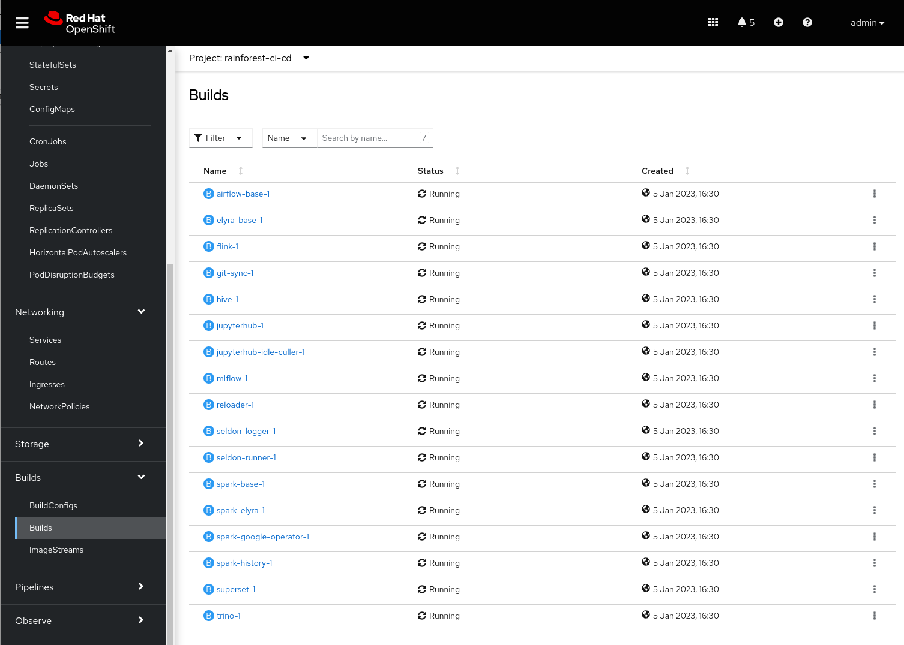

## 🏘️ Supply Chain Builds
## Build application images from source code

We want to manage our supply chain risk, so we build our container images to certain standards e.g. using Red Hat UBI based images. We use image builds from Dockerfiles exclusively as this is an easily understood and widely adopted standard. Doing so, we can also build images locally without issue - see the Makefiles in the **rainforest/supply-chain** folder.

We try to follow these standards in the **rainforest/supply-chain** folder.
 
- UBI base images.
- SSL CA certificates are packaged into the images so we can easily update them.
- Dependency packages are installed from a central repository (nexus in this case).
- The ability to build ALL non-vendor images from source code to minimize packaging supply chain risk.
- Image build process to test and flag any supply chain issues.
- Python base version should be standardized 3.8+
- JVM & JDK base version should be 11+ LTS openjdk version.
- Golang base version latest release 1.17+

## Argo App of Apps

We use the ArgoCD app-of-apps pattern to deploy the set of applications that would be owned by the AIMLOPS platform team. These are reusable assets that can be used by many different data science teams.

- Cluster scoped resources
- Shared S3 storage (minio)
- Shared Dependency tool (nexus)
- Shared secrets from Vault deployed declaratively
- Shared Image Builds

1. Login to the DevSpace Terminal and create our ArgoCD app of apps for **rainforest-ci-cd**

   ```bash
   cd /projects/data-mesh-pattern
   oc -n <TEAM_NAME>-ci-cd apply -f gitops/argocd/rainforest-ci-cd-dev-app-of-apps.yaml
   ```

<p class="warn">
    ⛷️ <b>NOTE</b> ⛷️ - The pod limit for SNO is increased from 250 -> 500 pods to accommodate more workloads. This will cause a brief outage whilst the KubeletConfig is applied. Once the node is queryable again you can see the increased pod capacity by running `oc describe node`
</p>
   

2. Monitor applications in ArgoCD.

   

   After several minutes all the applications will become **Synced**  

3. Monitor Builds in the **rainforest-ci-cd** project. When we create all the BuildConfig's for the first time, a build storm kicks off for all our images at once. The SNO cluster is sized to handle this OK, and the BuildConfig's have CPU and Memory limits set. Nexus is used as the dependency manager for all java and python libs (it starts and configures itself automatically). UBI RPM's are pulled from Red Hat directly.

   

   Not all Builds start immediately - some are triggered once their base image is built e.g. (airflow, spark, elyra). In the Lab, all BuildConfigs are configured to push images to the internal OpenShift registry.

   ☕☕☕ Monitor the Builds, they should all succeed. Some may need restarting if they fail for an unknown reason. Now is a great time to get some coffee, this step can take ~60mins ☕☕☕

   There is a convenience Tekton Pipeline configured to restart all builds together. If the node reboot for pod increase stops the builds - you can trigger them all in one go by starting this Pipeline.

   

4. Complete and Successful looks like this. When the number of **Complete** builds matches the number of **BuildConfig's**

   ```bash
   oc -n rainforest-ci-cd get bc --no-headers=true | wc -l
   ```
   
   ```bash
   oc -n rainforest-ci-cd get builds --no-headers=true | grep Complete | wc -l
   ```
